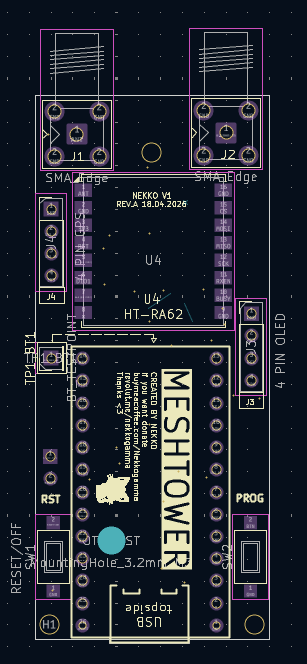
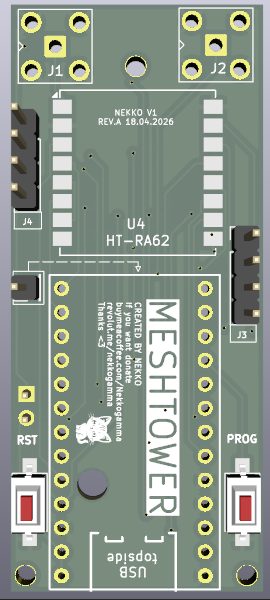
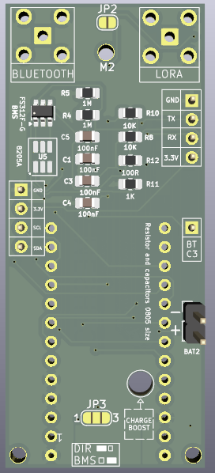

# 📘 Opis projektu / Project description

🇵🇱 **PL**

To jest wstępna wersja płytki PCB przeznaczonej dla modułu radiowego **HT-RA62**.

Płytka została zaprojektowana z myślą o oprogramowaniu **FakeTec** – działa na niej **Meshtastic** oraz **Meshcore**.

Projekt jest w trakcie budowy i nie został jeszcze przetestowany, dlatego może wymagać dalszych poprawek.  
Osobiście nie testowałem jeszcze tej konkretnej płytki, ale na podstawie założeń projektu **powinna działać poprawnie**.

W repozytorium znajduje się folder gerber_to_order z kompletnymi plikami produkcyjnymi, które można bezpośrednio wysłać do **JLCPCB**, aby wykonać własne prototypy i samodzielnie przetestować działanie płytki.

---

## ⚙️ Instrukcja montażu (PL)

| Punkt / złącze | Opis |
|----------------|------|
| **BT_C3** | Jeśli chcesz używać anteny Bluetooth, **połącz punkt BT_C3 z kondensatorem C3 znajdującym się na górze płytki ProMicro NRF52840**. |
| **J2** | **Musisz zlutować (zrobić zworkę)** w tym miejscu, jeśli **nie** wlutujesz tam kabelków od przycisku. Jest to **miejsce odcinania zasilania od pakietu baterii do płytki PCB**. |
| **BAT2** | W złącze **BAT2** wpinasz **pakiet baterii / zasilanie**. |
| **JP3** | Punkt na dole płytki PCB. Zlutuj odpowiednią zworkę w zależności od użytku:  • **DIRECT** – masz **bezpośrednie połączenie z bateriami bez układu BMS**  • **BMS** – zasilanie idzie **przez układ zabezpieczający (BMS)** |
| **CHARGEBOOST (ProMicro)** | ⚠️ **Nie zapomnij zlutować zworki CHARGEBOOST na płytce ProMicro**, bo dosięgnie cię *klątwa super-wolnego ładowania baterii*! |

---

🇬🇧 **ENG**

This is an early version of a PCB designed for the **HT-RA62** radio module.

The board is intended to be used with **FakeTec-based firmware** – it supports **Meshtastic** and **Meshcore**.

The project is still under development and has not been tested yet, so it may require further adjustments.  
I have not tested this particular board myself yet, but based on the design it **should work correctly**.

The repository includes a folder with complete manufacturing files that can be sent directly to JLCPCB to produce your own prototypes and test the board yourself.

---

## ⚙️ Assembly instructions (ENG)

| Point / connector | Description |
|-------------------|-------------|
| **BT_C3** | If you want to use the Bluetooth antenna, **connect the BT_C3 point to the capacitor C3 located on the top side of the ProMicro NRF52840 board**. |
| **J2** | You **must solder a jumper** here if you do **not** solder wires from the push button. This is the **power cut-off point from the battery pack to the PCB**. |
| **BAT2** | Plug the **battery pack / power supply** into the **BAT2** connector. |
| **JP3** | Point at the bottom of the PCB. Solder the jumper depending on your use case:  • **DIRECT** – **direct connection to the batteries without the BMS**  • **BMS** – power goes **through the protection circuit (BMS)** |
| **CHARGEBOOST (ProMicro)** | ⚠️ **Don’t forget to solder the CHARGEBOOST jumper on the ProMicro board**, otherwise you’ll be cursed with *super-slow battery charging*! |

## 📦 BOM – Bill of Materials
| Element / Part                               | Opis / Description                      | Link                                       |
|----------------------------------------------|-----------------------------------------|--------------------------------------------|
| **Guzik 3x6x4.3mm / Button**                 | Tactile switch                          | https://s.click.aliexpress.com/e/_c45q3wJj |
| **Pro Micro NRF**                            | Moduł sterujący / controller module     | https://s.click.aliexpress.com/e/_c35eE1rf |
| **Rezystory 0805 / Resistors 0805**          | Standard SMD resistors                  | https://s.click.aliexpress.com/e/_c3W7grmd |
| **Kondensatory 0805 / Capacitors 0805**      | Standard SMD capacitors                 | https://s.click.aliexpress.com/e/_c32s48df |
| **BMS F312F‑G**                              | Battery management system               | https://s.click.aliexpress.com/e/_c4cIWJS9 |
| **MOSFET 8205A**                             | Dual MOSFET                             | https://s.click.aliexpress.com/e/_c3kEg6Cz |
| **2xZŁĄCZE SMA(GÓRNE)BWSMA-KWE-Z001**        | 2xSMA CONNECTOR(UP)BWSMA-KWE-Z001       | https://s.click.aliexpress.com/e/_c3BdU6El |
| **Moduł Radiowy HT-RA62(868Mhz)**            | HT-RA62 LORA RADIO MODULE(868Mhz)       | https://s.click.aliexpress.com/e/_c3Z7NUnB |
| **(Opcjonalnie) OLED 0.96" SSD1306**         | Optional display                        | https://s.click.aliexpress.com/e/_c36V0BV3 |
| **(Opcjonalnie) GPS**                        | Optional GPS                            | https://s.click.aliexpress.com/e/_c3rXLNln |

## 💖 Pomóż mi tworzyć dalej 💖

Ten projekt powstał z **pasji i chęci pomocy innym** – może właśnie **Tobie**.  
Jeśli **pomogłem Ci w czymś ważnym**, możesz się odwdzięczyć symbolicznie:  
**☕ kawą, 🍺 piwkiem albo energetykiem ⚡ – wybór należy do Ciebie!**

### 🧠 Twoje wsparcie:

- **Pozwala rozwijać** ten i kolejne projekty 🚀  
- **Pokazuje, że to co robię, ma sens** ❤️  
- **Realnie wpływa** na to, co mogę dać innym.
- **Motywuje** mnie do działania i częstych aktualizacji 🔄  
- **Pomaga kolejnym osobom**, którym może się to przydać 🙌  
- **Dajesz mi znak, że to działa i warto** 👏

###  **Metody Wsparcia:**
### ☕︎ **Wsparcie przez BuyMeCoffee:**

### 📲 **Wsparcie przez Revolut:**

1. **Nazwa użytkownika**: `@nekkogamma`  
2. **Bezpośredni link** do darowizny:  
   [Kliknij tutaj, aby wesprzeć](https://revolut.me/nekkogamma)

3. **Revolut QR** (skanowanie):  

🔗 **Alternatywnie**:  
[revolut.me/nekkogamma](https://revolut.me/nekkogamma)

  
